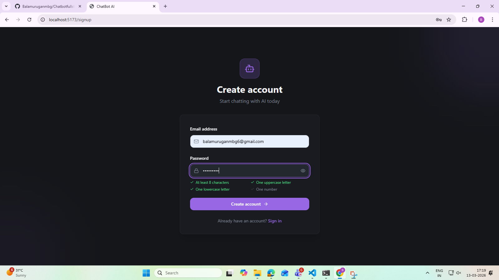
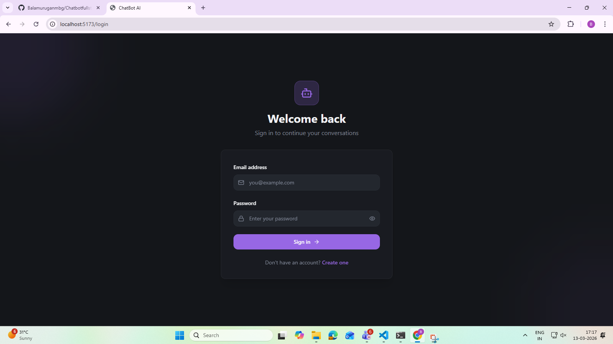
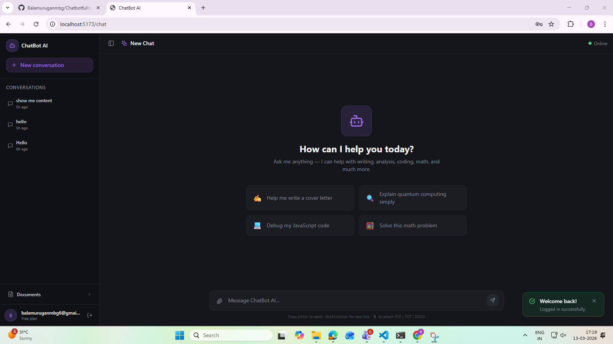
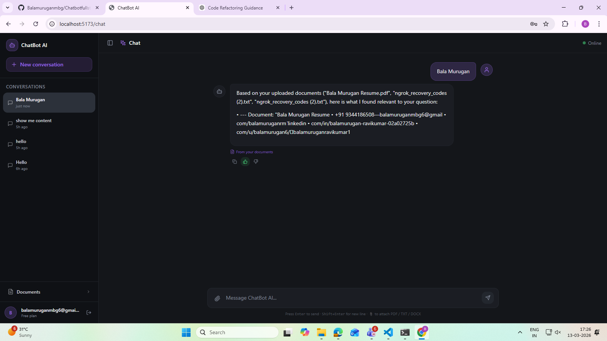
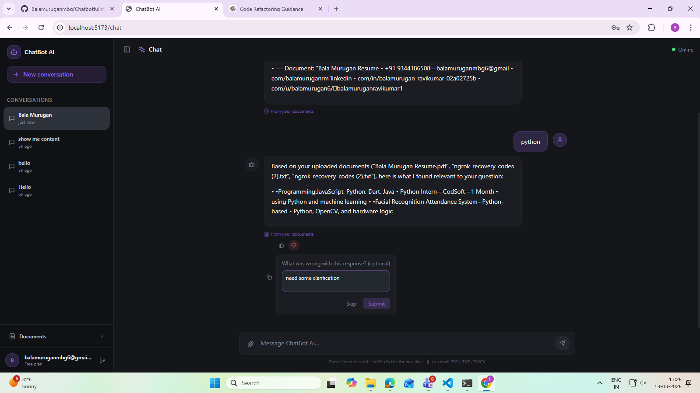
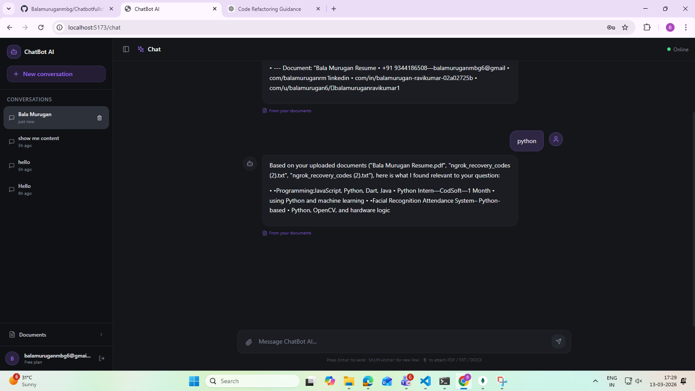

# ChatBot AI — Production-Grade Full-Stack Chatbot

A production-quality AI chatbot web application built with modern technologies, clean architecture, and enterprise-level patterns. Modeled after ChatGPT/Notion AI UI with streaming responses, chat history, document uploads, and a feedback system.

---

## Tech Stack

| Layer | Technology |
|-------|-----------|
| Frontend | React 18 + Vite + TypeScript |
| Styling | TailwindCSS + Glassmorphism dark theme |
| State | Zustand + TanStack Query |
| Animations | Framer Motion |
| Backend | Node.js + Express.js + TypeScript |
| Database | MongoDB + Mongoose |
| Auth | JWT + bcrypt |
| Streaming | Server-Sent Events (SSE) |
| File Upload | Multer |
| Security | Helmet + Rate Limiting + express-validator |

---

## Architecture

```
Clean Architecture — Controller → Service → Repository → Database
```

### Backend
```
backend/src/
├── controllers/      # HTTP request handlers
├── services/         # Business logic
├── repositories/     # Database abstraction layer
├── models/           # Mongoose schemas
├── routes/           # Express route definitions
├── middlewares/      # Auth, error, upload, validation
├── config/           # DB connection, env config
├── utils/            # JWT, password, logger, response helpers
└── types/            # Shared TypeScript types
```

### Frontend
```
frontend/src/
├── app/              # Page components (login, signup, chat)
├── components/       # Reusable UI components
│   ├── chat/         # ChatContainer, ChatMessage, ChatInput
│   ├── sidebar/      # ChatSidebar with history
│   ├── documents/    # DocumentUploader
│   ├── feedback/     # FeedbackButtons (👍 👎)
│   ├── layout/       # MainLayout, ProtectedRoute
│   └── ui/           # Toast
├── hooks/            # useChat, useAuth, useToast
├── services/         # API clients
├── store/            # Zustand stores
└── types/            # Shared types
```

---

## Features

- **Authentication** — JWT-based signup/login with bcrypt password hashing
- **Chat** — Real-time streaming responses via SSE (token-by-token like ChatGPT)
- **Chat History** — Persistent sidebar with all conversations, auto-generated titles
- **Markdown** — Full GFM markdown rendering in assistant messages
- **Document Upload** — PDF, TXT, DOCX with drag-and-drop support
- **Feedback** — 👍 / 👎 per message with optional comment
- **Dark Mode** — Full glassmorphism dark UI with smooth animations
- **Skeleton Loaders** — Shimmer skeletons while loading
- **Toast Notifications** — Animated success/error toasts
- **Security** — Helmet, CORS, rate limiting, input validation, file type validation

---

## Screenshots

### Sign Up


### Login


### Home


### PDF Parsing


### Feedback




### Delete Chat


---

## Database Structure

### Users Collection


### Chats Collection


### Messages Collection


### Documents Collection


### Feedback Collection


---

## Database Schema

```
Users:     _id, email, password_hash, createdAt, updatedAt
Chats:     _id, userId, title, createdAt, updatedAt
Messages:  _id, chatId, role (user|assistant), content, createdAt
Documents: _id, userId, fileName, originalName, filePath, fileSize, mimeType, uploadedAt
Feedback:  _id, messageId, userId, rating (like|dislike), comment, createdAt
```

---

## API Reference

### Authentication
| Method | Endpoint | Auth | Description |
|--------|----------|------|-------------|
| POST | `/api/auth/signup` | — | Register new user |
| POST | `/api/auth/login` | — | Login |
| POST | `/api/auth/logout` | ✓ | Logout |
| GET | `/api/auth/profile` | ✓ | Get current user |

### Chat
| Method | Endpoint | Auth | Description |
|--------|----------|------|-------------|
| GET | `/api/chat/history` | ✓ | Get all conversations |
| GET | `/api/chat/:chatId` | ✓ | Get chat + messages |
| POST | `/api/chat/message` | ✓ | Send message (non-streaming) |
| POST | `/api/chat/stream` | ✓ | Send message (SSE streaming) |
| DELETE | `/api/chat/:chatId` | ✓ | Delete conversation |

### Documents
| Method | Endpoint | Auth | Description |
|--------|----------|------|-------------|
| POST | `/api/documents/upload` | ✓ | Upload document |
| GET | `/api/documents` | ✓ | List documents |
| DELETE | `/api/documents/:documentId` | ✓ | Delete document |

### Feedback
| Method | Endpoint | Auth | Description |
|--------|----------|------|-------------|
| POST | `/api/feedback` | ✓ | Submit feedback |
| GET | `/api/feedback/:messageId` | ✓ | Get feedback for message |

---

## Installation & Setup

### Prerequisites
- Node.js 18+
- MongoDB (local or Atlas)

### 1. Clone and install dependencies

```bash
# Install root dependencies
npm install

# Install all dependencies
npm run install:all
```

### 2. Configure environment variables

```bash
# Backend
cp backend/.env.example backend/.env
# Edit backend/.env and set your MongoDB URI and JWT secret

# Frontend
cp frontend/.env.example frontend/.env
```

#### Backend `.env`
```env
NODE_ENV=development
PORT=5000
MONGODB_URI=mongodb://localhost:27017/chatbot_db
JWT_SECRET=your_super_secret_jwt_key_min_32_chars
JWT_EXPIRES_IN=7d
CORS_ORIGIN=http://localhost:5173
```

### 3. Run in development

```bash
# Run both backend and frontend concurrently
npm run dev

# Or run separately:
npm run dev --prefix backend   # http://localhost:5000
npm run dev --prefix frontend  # http://localhost:5173
```

### 4. Build for production

```bash
npm run build:backend
npm run build:frontend
```


---

## Security Considerations

- Passwords hashed with bcrypt (12 rounds)
- JWT with configurable expiry
- Helmet sets secure HTTP headers
- CORS restricted to configured origin
- Global rate limiting (100 req/15 min)
- Auth endpoints limited (10 req/15 min)
- File upload validation: type + size
- Input validation on all endpoints
- MongoDB injection prevented by Mongoose
- Error messages don't leak stack traces in production

---

## Project Structure (Full)

```
.
├── backend/
│   ├── src/
│   │   ├── controllers/
│   │   │   ├── auth.controller.ts
│   │   │   ├── chat.controller.ts
│   │   │   ├── document.controller.ts
│   │   │   └── feedback.controller.ts
│   │   ├── services/
│   │   │   ├── auth.service.ts
│   │   │   ├── chat.service.ts
│   │   │   ├── document.service.ts
│   │   │   └── feedback.service.ts
│   │   ├── repositories/
│   │   │   ├── user.repository.ts
│   │   │   ├── chat.repository.ts
│   │   │   ├── message.repository.ts
│   │   │   ├── document.repository.ts
│   │   │   └── feedback.repository.ts
│   │   ├── models/
│   │   │   ├── User.ts
│   │   │   ├── Chat.ts
│   │   │   ├── Message.ts
│   │   │   ├── Document.ts
│   │   │   └── Feedback.ts
│   │   ├── routes/
│   │   │   ├── auth.routes.ts
│   │   │   ├── chat.routes.ts
│   │   │   ├── document.routes.ts
│   │   │   └── feedback.routes.ts
│   │   ├── middlewares/
│   │   │   ├── auth.middleware.ts
│   │   │   ├── error.middleware.ts
│   │   │   ├── upload.middleware.ts
│   │   │   └── validation.middleware.ts
│   │   ├── config/
│   │   │   ├── db.ts
│   │   │   └── env.ts
│   │   ├── utils/
│   │   │   ├── jwt.ts
│   │   │   ├── password.ts
│   │   │   ├── logger.ts
│   │   │   └── apiResponse.ts
│   │   ├── types/index.ts
│   │   ├── app.ts
│   │   └── server.ts
│   ├── uploads/          # Uploaded files stored here
│   ├── .env.example
│   ├── package.json
│   └── tsconfig.json
│
├── frontend/
│   ├── src/
│   │   ├── app/
│   │   │   ├── login/LoginPage.tsx
│   │   │   ├── signup/SignupPage.tsx
│   │   │   └── chat/ChatPage.tsx
│   │   ├── components/
│   │   │   ├── chat/
│   │   │   │   ├── ChatContainer.tsx
│   │   │   │   ├── ChatMessage.tsx
│   │   │   │   └── ChatInput.tsx
│   │   │   ├── sidebar/ChatSidebar.tsx
│   │   │   ├── documents/DocumentUploader.tsx
│   │   │   ├── feedback/FeedbackButtons.tsx
│   │   │   ├── layout/
│   │   │   │   ├── MainLayout.tsx
│   │   │   │   └── ProtectedRoute.tsx
│   │   │   └── ui/Toast.tsx
│   │   ├── hooks/
│   │   │   ├── useAuth.ts
│   │   │   ├── useChat.ts
│   │   │   └── useToast.ts
│   │   ├── services/
│   │   │   ├── api.ts
│   │   │   ├── auth.service.ts
│   │   │   ├── chat.service.ts
│   │   │   ├── document.service.ts
│   │   │   └── feedback.service.ts
│   │   ├── store/
│   │   │   ├── authStore.ts
│   │   │   └── chatStore.ts
│   │   ├── types/index.ts
│   │   ├── lib/utils.ts
│   │   ├── index.css
│   │   ├── main.tsx
│   │   └── App.tsx
│   ├── .env.example
│   ├── index.html
│   ├── package.json
│   ├── tailwind.config.js
│   └── vite.config.ts
│
├── package.json       # Root monorepo scripts
└── README.md
```
